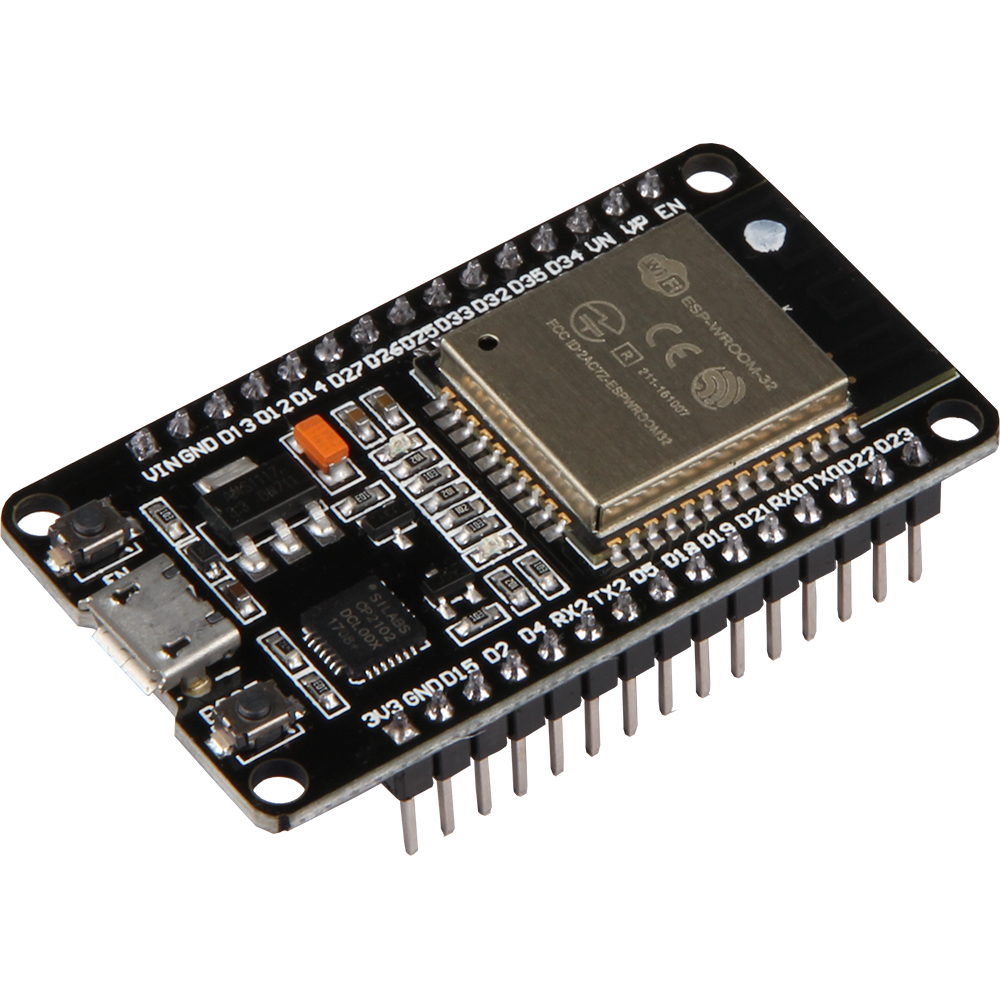
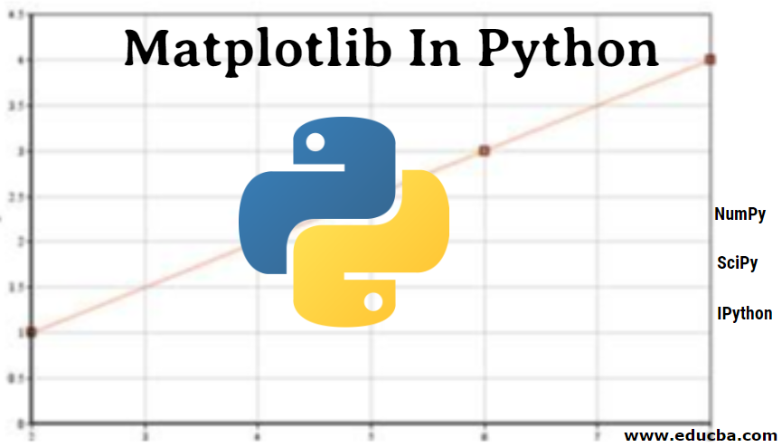
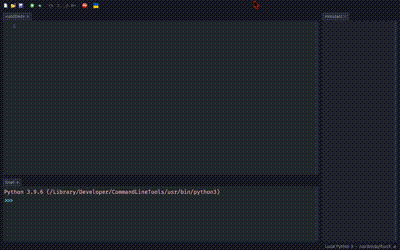

# DIY ESP32 Weather Dashboard

What you will need-

- an ESP32 board
- a computer
- internet
- A breaboard
- an DHT22 sensor
- Jumper wires
- A 10KΩ resistor

## ESP32 part



If you're into IOT, you may know about the [ESP32](https://en.wikipedia.org/wiki/ESP32 "Espressif 32") boards. They're
amazing little [microcontrollers](https://en.wikipedia.org/wiki/Microcontroller) like [Arduino's](https://arduino.cc)
but are superfast, have Wi-Fi and Bluetooth, have WAY more GPIO and have additional features you can check
out [here](https://www.espressif.com/sites/default/files/documentation/esp32_datasheet_en.pdf).  
_Note that I'm using a board with the 'esp32' module and not ESP32 S/C series, as they have quite different features._  
You can buy them
from [here](https://www.amazon.com/Espressif-ESP32-DevKitC-32E-Development-Board/dp/B087TF2L27/ref=sr_1_4?crid=1HARU8KDQT6N0&dib=eyJ2IjoiMSJ9.-6lKg2R3US-875qNyc0riDIz2Cvp1w0ToLH9rfNmkgW2lJdJKT0_UCiZqn_4VkQWc3jNyg8-1LyIF7r8aB5H_9xRqUz6kj36mYsCKVH03cesnM4l7QDH027iXFdpEJ6oOH212CmlmqPhemfo6vQUfOitGpzYvzYrEiG-g6wRybVXZXp_eWukN6uCot8R0ehNE_6JatJpBEF9EHe_m8VFeG7ns9sBZxuEqhJJiBfjyvA.Uc6opg3brKSuadUzTyV2rIU_ha38sTefiPBXOeyOza0&dib_tag=se&keywords=ESP32%2BdevkitC&qid=1729153015&sprefix=esp32%2Bdevkitc%2B%2Caps%2C354&sr=8-4&th=1).
I'm learning how to use it. If you want to get started, I recommend these
links: [Random Nerd Tutorials](https://randomnerdtutorials.com/projects-esp32/)
or [Last Minute Engineers](https://lastminuteengineers.com/electronics/esp32-projects//). I suggest you go to
[this article](https://lastminuteengineers.com/esp32-dht11-dht22-web-server-tutorial/) for extra reference.

- - -

The [DHT22](https://components101.com/sensors/dht22-pinout-specs-datasheet) (also known as AM2302) is an easy-to-use,
and cheap temperature/humidity sensor which is popular with hobbyists and tinkerers. Although their readings are not so
accurate and have a limited range, I'm using them as there's a lot of support (libraries, tutorials) for it. You can buy
it [here](https://www.amazon.com/SHILLEHTEK-Digital-Temperature-Humidity-Sensor/dp/B0CN5PN225/ref=sxin_16_pa_sp_search_thematic_sspa?content-id=amzn1.sym.140400a7-1208-46ad-8d2a-eb6e8eac81b5%3Aamzn1.sym.140400a7-1208-46ad-8d2a-eb6e8eac81b5&crid=3CEHINK9T76S0&cv_ct_cx=dht22&dib=eyJ2IjoiMSJ9.Ma1AjrJgqkiJIlS5iiURH2ld682K-K5X93DQuOrxeiLOCF50-B9QsiRYIgYQEvh3.q7-E7pLpZJ3Dw4SRgj3p0D4JqikCJteA2BFY5j8CilQ&dib_tag=se&keywords=dht22&pd_rd_i=B0CN5PN225&pd_rd_r=0bc30da3-374b-4680-b92a-87abd0fa8336&pd_rd_w=cBns6&pd_rd_wg=erXKP&pf_rd_p=140400a7-1208-46ad-8d2a-eb6e8eac81b5&pf_rd_r=QH3X85W4SAARBXRER1DC&qid=1729229360&sbo=RZvfv%2F%2FHxDF%2BO5021pAnSA%3D%3D&sprefix=dht2%2Caps%2C270&sr=1-3-6024b2a3-78e4-4fed-8fed-e1613be3bcce-spons&sp_csd=d2lkZ2V0TmFtZT1zcF9zZWFyY2hfdGhlbWF0aWM&psc=1).

I wanted to log data from a DHT22 and then display it on a dashboard on my MacBook. I researched different options
like [Influx DB](https://randomnerdtutorials.com/esp32-influxdb/), [Blynk IOT,](https://www.instructables.com/Use-ESP32-to-Control-LED-With-Blynk-Via-WiFi/) [Arduino Cloud](https://microcontrollerslab.com/arduino-iot-cloud-esp32-send-sensor-readings-control-outputs/), [Adafruit IO,](https://www.electronicwings.com/esp32/esp32-mqtt-client)
but they're all paid, and their free plans suck. No offense, So I decided to create my own API! This API uses a
simple [HTTP POST](https://en.wikipedia.org/wiki/POST_(HTTP)) method to output the temperature in
a [JSON](https://en.wikipedia.org/wiki/JSON "JavaScript Object Notation") format. Here's the code:

```cpp 
#include <WiFi.h>
#include <WebServer.h>
#include <Arduino.h>
#include <DHT.h>

// Replace with your WiFi credentials
const char* ssid = "SSID";
const char* password = "SecretPassword";

// DHT Sensor settings
#define DHTPIN 2     // Digital pin connected to the DHT sensor
#define DHTTYPE DHT22   // DHT 22

DHT dht(DHTPIN, DHTTYPE);
WebServer server(80);

void notfound(){
  server.send(404,"text/plain","Not Found");
}

void handleRoot() {
  // Reading temperature or humidity takes about 250 milliseconds!
  // Sensor readings may also be up to 2 seconds 'old' (its a very slow sensor)
  float h = dht.readHumidity();
  // Read temperature as Celsius (the default)
  float t = dht.readTemperature(); 
  // Read temperature as Fahrenheit (isFahrenheit = true)
  float f = dht.readTemperature(true);

  // Check if any reads failed and exit early (to try again).
  if (isnan(h) || isnan(t) || isnan(f)) {
    Serial.println(F("Failed to read from DHT sensor!")); 
    server.send(500, "text/plain", "Failed to read from DHT sensor!");
    return;
  }

  // Compute heat index in Fahrenheit (the default)
  float hif = dht.computeHeatIndex(f, h);
  // Compute heat index in Celsius (isFahreheit = false)
  float hic = dht.computeHeatIndex(t, h, false);

  // Create the JSON response as a String
  String json = "{";
  json += "\\"temperature\\":"  + String(t) + ",";
  json += "\\"humidity\\":"  + String(h) + ",";
  json += "\\"heatIndex\\":"  + String(hic); 
  json += "}";

  // Set the response content type to application/json
  server.sendHeader("Content-Type", "application/json");
  server.send(200, "application/json", json);
}

void setup() {
  Serial.begin(115200);
  dht.begin();

  // Connect to WiFi
  WiFi.begin(ssid, password);
  while (WiFi.status() != WL_CONNECTED) {
    delay(1000);
    Serial.println("Connecting to WiFi...");
  }
  Serial.println("Connected to WiFi");

  // Set up the web server
  server.on("/", handleRoot);
  server.onNotFound(notfound);
  server.begin();
  Serial.println("Web server started");
  Serial.print("http://");Serial.print(WiFi.localIP());
}

void loop() {
  server.handleClient();

  // Send the JSON data every 2 seconds
  static unsigned long lastSendTime = 0;
  if (millis() - lastSendTime >= 2000) {
    handleRoot();
    lastSendTime = millis();
  }
}
```

---
Install Arduino IDE and the ESP32 core on your computer. I won't go into much detail, but you can find a specific
tutorial [here](https://lastminuteengineers.com/getting-started-with-esp32/). Copy-paste the code in and Arduino IDE and
replace "SSID" and "SecretPassword" with your 2.4 GHZ WiFi SSID and Password in lines 5,6.Then press the 'Upload'
button. Then wire the ESP32 like the [table below](). Open the serial monitor, and a link like http://192.168.50.212
will be displayed. Type the link in you favourite browser, and _Voila!_ something like
`:::json   {   "temperature":34,   "humidity":12,   "heatIndex":32   }` will appear.

Wiring Diagram

| ESP32 pin | DHT22 pin                                     |
|-----------|-----------------------------------------------|
| 3V →      | VCC/+                                         |
| D2 →      | Data/SDA (Add a 10KΩ PullUp resistor to 3.3V) |
| GND →     | GND/-                                         |

## Python/computer part



So now we have a functional JSON api, so now what do we do with it? JSON is not that easy-to-understand so we'll make a
graph to plot the data using Python. You can use any other programming language, but Python is an easy and fun language
to code in, so I'm using.Thonny is a easy-to-use, beginner-friendly Python code editor, so we'll use it, but you can use
any Python IDE if you want to. Go to [the Thonny website](https://thonny.org/) and download Thonny. You can learn more
about Python on [RealPython](https://realpython.com/) and [W3schools](https://www.w3schools.com/python/default.asp)
websites. We are going to use a popular plotting library called _[MatPlotLib](https://matplotlib.org/)_ and a JSON
decoding library callled _[μjson](https://github.com/ultrajson/ultrajson)_.
---


Before you upload your code, open Thonny, then go to Tools > Manage packages and type `Ujson` and click ujson, then click <kbd>install</kbd>. Then click Close, go to Tools > Manage packages and type `Matplotlib` and click matplotlib,then click <kbd>install</kbd>. Or **JUST FOLLOW THE GIF ABOVE**

Replace `"http://192.168.50.212"` in the code with the link in the serial monitor. Run the code using F5. So, here's the code:

```python
import requests
import matplotlib.pyplot as plt
import time
import threading

# Replace with link in serial monitor
url = "http://192.168.50.212/"

# Variables to store the data
temperature = []
humidity = []
heat_index = []

# Function to fetch data from the Arduino web server
def fetch_data():
   while True:
       try:
           # Send a GET request to the Arduino web server
           response = requests.get(url)
           
           # Parse the JSON data
           data = response.json()
           
           # Append the data to the lists
           temperature.append(data["temperature"])
           humidity.append(data["humidity"])
           heat_index.append(data["heatIndex"])
           
           # Wait for 2 seconds before fetching the next data
           time.sleep(2)
       except:
           print("Error fetching data")

# Start the data fetching thread
data_thread = threading.Thread(target=fetch_data)
data_thread.start()

# Plot the data
plt.figure(figsize=(12, 6))

# Temperature plot
plt.subplot(1, 3, 1)
plt.plot(temperature)
plt.title("Temperature")
plt.xlabel("Time")
plt.ylabel("Temperature (°C)")

# Humidity plot
plt.subplot(1, 3, 2)
plt.plot(humidity)
plt.title("Humidity")
plt.xlabel("Time")
plt.ylabel("Humidity (%)")

# Heat index plot
plt.subplot(1, 3, 3)
plt.plot(heat_index)
plt.title("Heat Index")
plt.xlabel("Time")
plt.ylabel("Heat Index (°C)")

plt.tight_layout()
plt.show()
```

- - -

So there, we have a free, open-source, and highly customizable ESP32 DHT22 weather dashboard! Get the code from [my Github Repo](https://github.com/IshaantNandu/Esp32_HTTP_post) . See you later for more blogs 😁.


