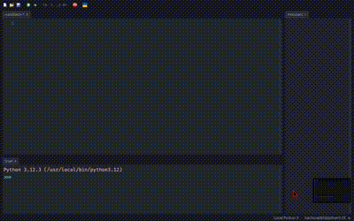

# Python Password Generator

What you will need-

*   a computer running Windows,Linux or MacOs
*   internet

### Abstract

These days, as computers are getting more and more powerful, safety becomes a larger issue. One way to keep a password safe is to make it long, and confusing, but many people use birthday dates, numerical patterns and simple passwords, which make it vulnerable to [brute force attacks](https://en.wikipedia.org/wiki/Brute-force_attack). I've created an easy-to-use, simple and effective password generator in Python.

- - -

In my [first article](../esp32Api/esp32Api.html), I've talked about [Python](https://www.python.org) being an easy-to-use and fun language, with minimal syntax, so I'm gonna use it. If you haven't checked out my previous article, I suggest you check it out [here](../esp32Api/esp32Api.html). We're gonna use a python library called _[Secrets](https://docs.python.org/3/library/secrets.html)_ and an IDE called Thonny. Again, Thonny is a easy-to-use, beginner-friendly Python code editor, so we'll use it, but you can use any Python IDE if you want to.

- - -

### Prerequisites

Install thonny from [the Thonny website](https://thonny.org/).


Before you upload your code, open Thonny, then go to Tools > Manage packages and type Secrets and click Secrets, then click install. Or **JUST FOLLOW THE GIF ABOVE** So here's the code:-

```python 
from secrets import token_urlsafe as passwordx
from random import randrange as ranBit
class PasswordGenerator():
    def __init__(self,*args,**kwargs):
        self.NumOfBytes,self.BruteForceBytes=ranBit(4,10),ranBit(64,256)
        self.MaxIter=2
        self.IterCount=0
    @property
    def BruteForcePassword(self,*args,**kwargs):
        """
        Gives a password which *Maybe* is Brute-Force safe
        """
        return passwordx(self.BruteForceBytes)
    @property
    def NormalPassword(self,*args,**kwargs):
        return passwordx(self.NumOfBytes)
    def SetupDaemon(self,*args,**kwargs):
        print("Welcome to Password Generator By Ishaant Nandu")
        BruteForceAsker=input("Do you want a Brute-Force safe password? (Y/n)")
        BruteForceAsker=BruteForceAsker.upper()
        if BruteForceAsker=="Y" or BruteForceAsker=="'Y'":
            print(f"Password: {self.BruteForcePassword} ")
            return None
        elif BruteForceAsker=="N" or BruteForceAsker=="'N'":
            print(f"Password: {str(self.NormalPassword)}")
            return None
        else:
            if self.IterCount<=self.MaxIter:
                print("Sorry, Didn't understand, please input 'n' for no or 'y' for yes")
                self.SetupDaemon()
                self.IterCount +=1
            else:
                raise(NameError(f"You didn't follow the instructions to input 'y' or 'n' {self.IterCount} times, so your code DESERVES to have an error 😭 "))
            
            

            
if __name__=="__main__":
    x=PasswordGenerator(2)
    x.SetupDaemon()
```
I'm too lazy to explain the code- so here's an AI generated explanation-

The provided code is a Python script that generates a password using the secrets and random modules. Let's break down the code and explain its functionality

**Imports:**  
`from secrets import token_urlsafe as passwordx` : This line imports the token\_urlsafe function from the secrets module and renames it as passwordx. The token\_urlsafe function generates a URL-safe token, which is used to create the password.  
`from random import randrange as ranBit`: This line imports the randrange function from the random module and renames it as ranBit. The randrange function generates a random integer within a specified range, which is used to determine the length of the password.

**PasswordGenerator Class:**  
`__init__(self, *args, **kwargs)`: The constructor initializes the class with the following attributes:  
\- `self.NumOfBytes`: A random number between 4 and 10, representing the number of bytes for a "normal" password.  
\- `self.BruteForceBytes` : A random number between 64 and 256, representing the number of bytes for a "brute-force safe" password.  
\- `self.MaxIter`: The maximum number of iterations allowed for the SetupDaemon method.  
\- `self.IterCount`: A counter for the number of iterations in the SetupDaemon method.  
`BruteForcePassword`: This property method returns a password generated using `passwordx(self.BruteForceBytes)`, which creates a URL-safe token with the specified number of bytes.  
`NormalPassword`: This property method returns a password generated using `passwordx(self.NumOfBytes)`, which creates a URL-safe token with the specified number of bytes.  
`SetupDaemon(self, *args, **kwargs)`: This method is responsible for the user interaction and password generation. It prompts the user to choose between a "brute-force safe" password or a "normal" password, and then prints the generated password.

**Main Block:**  
`if __name__ == "__main__":` : This block ensures that the code inside is only executed when the script is run directly (not imported as a module).  
`x = PasswordGenerator(2)`: An instance of the PasswordGenerator class is created with the argument 2.  
`x.SetupDaemon()`: The SetupDaemon method is called on the PasswordGenerator instance, which starts the user interaction and password generation.

The purpose of this script is to provide a simple password generator that can generate either a "normal" password or a "brute-force safe" password, based on the user's input. The "brute-force safe" password is generated with a larger number of bytes, making it more secure against brute-force attacks.

The script also includes some error handling, where it prompts the user to input 'y' or 'n' up to a maximum number of iterations (defined by `self.MaxIter`). If the user fails to provide a valid input after the maximum number of iterations, the script raises a `NameError` with a custom error message.
---
I hope you had fun reading this blog. Get the code from [my Github Repo](https://github.com/IshaantNandu/PyPassGenerator). See you later for more blogs 😁.